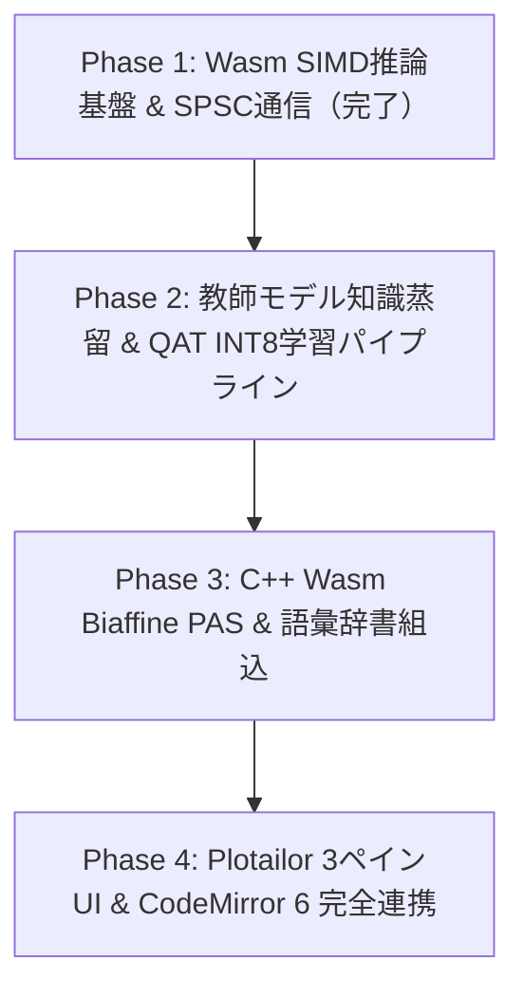

# Narrative-Nano 包括的実装計画書 (Comprehensive Implementation Plan)

- **文書ID**: NARRATIVE_NANO_COMPREHENSIVE_IMPLEMENTATION_PLAN.md
- **対象リポジトリ**: `ughirose/narrative-nano`
- **策定日時**: 2026-09-25 22:20 JST
- **準拠憲法**: 3ペイン統合IDE憲法・単発モーダル新設厳禁・ゼロコピーSPSC Ring Buffer・エディタ座標1対1マッピング

---

## 1. エグゼクティブサマリー & 構想の再定義

Narrative-Nanoは、長編Web小説・文芸創作における「設定矛盾」「主語・述語のねじれ」「視点（POV）の不意の漏洩（認知フォグ違反）」を作家の打鍵速度（IKI: 50〜200ms）を一切阻害せずにリアルタイム検知するための**ブラウザ完全内蔵型・極小マルチタスク推論コア（5.8Mパラメータ）**である。

### コア設計思想
1. **完全文字レベル（Character-Level）入力**:
   - 形態素解析辞書（MeCab/UniDic）やBPEサブワード分割器を排除。
   - 語彙サイズ $V=2,048$ 固定（常用漢字＋主要文芸漢字＋ひらがな＋カタカナ＋約物）。
   - 文字列座標とエディタ（CodeMirror 6）のオフセットが1対1で完全一致し、ルビや波線の座標ズレを根絶。
2. **極小サイズ & Wasm SIMD 128-bit 高速化**:
   - 6層 双方向 Transformer Encoder（$d_{\text{model}}=256, H=4, d_{\text{ff}}=1024, L_{\text{max}}=128$）。
   - INT8 対称量子化により重みバイナリサイズを **約 2.5MB〜4MB** に圧縮。
   - C++17 Wasm SIMD（`-msimd128 -O3 -flto`）による 1 回の順伝播レイテンシ **< 5ms**。
3. **ゼロコピー SPSC Lock-free Ring Buffer 通信**:
   - 16MB `SharedArrayBuffer` によるUIスレッド・Worker間の非同期分離。
   - 320バイト固定長パケット（メタデータ64B＋トークン256B）、64Bキャッシュラインパディング、`0xFF` 終端センチネル。
   - 50ms Watchdogによる強制再起動・自動Cold Resync機構。

---

## 2. 5大出力ヘッド数理モデルと責務境界

エンコーダ最終層の出力表現を $\mathbf{H} = [h_1, h_2, \dots, h_L] \in \mathbb{R}^{L \times 256}$ とする。

| ヘッド名 | 目的 | 数理定義 | 出力形状 |
| :--- | :--- | :--- | :--- |
| **1. ModalityHead** | 地の文と会話文（鍵括弧・心情描写）の二値判別 | $\hat{\mathbf{y}}_i^{\text{mod}} = \mathrm{softmax}(\mathbf{W}_{\text{mod}} h_i + b_{\text{mod}})$ | $[L, 2]$ |
| **2. OffsetHead** | 文字 $i$ から係り先主辞 $j$ への相対オフセット $\Delta_i \in [-32, +32]$ | $\hat{\mathbf{y}}_i^{\text{offset}} = \mathrm{softmax}(\mathbf{W}_{\text{offset}} h_i + b_{\text{offset}})$ | $[L, 65]$ |
| **3. LabelHead** | 係り受け関係分類（ROOT, D, APPOSITION, P, A, I 等） | $\hat{\mathbf{y}}_i^{\text{label}} = \mathrm{softmax}(\mathbf{W}_{\text{label}} h_i + b_{\text{label}})$ | $[L, 8]$ |
| **4. DynamicBiaffinePASHead** | 主要10格（ガ, ヲ, ニ, ト, デ, カラ, ヨリ, ヘ, マデ等）の述語項構造 | $\mathbf{S}_{c, i, j} = (h_i^{\text{pred}})^T \mathcal{U}_c h_j^{\text{arg}}$ | $[10, L, L]$ |
| **5. EpistemicPOVHead** | 語り手視点と登場人物認知状態の不整合（POV漏洩確率） | $p_i^{\text{leak}} = \sigma(\mathbf{W}_{\text{pov}} h_i + b_{\text{pov}})$ | $[L, 1]$ |

---

## 3. 実装ロードマップ（4段階フェーズ）

### Phase 1: Wasm推論基盤 & 通信プロトコル【完了】
- `narrative_core.cpp`（262KB Wasmバイナリ出力完了）
- 16MB SPSC Ring Bufferベンチマーク（平均 0.493μs、損失率 0%）
- ONNX Runtime Web INT8 ローダー & Web Worker ラッパー

### Phase 2: 合成データ生成 & 教師モデル知識蒸留（Google Colab連携）
- **対象スクリプト**: `narrative-nano/docs/reference/distill_narrative_nano.py`
- **データセット構築**:
  - Gemini 2.0 Flash / Pro を用いて、日本語文芸小説から 50,000 件の（文章、格関係、係り受け、視点タグ）アノテーションペアを合成。
- **学習プロセス**:
  - PyTorch ベースで 6層 Transformer を事前学習（Masked Language Modeling: MLM）。
  - 教師モデル（Tohoku BERT / RoBERTa）からの Logits 蒸留（Temperature $T=2.0$, $\alpha=0.5$）。
  - PyTorch QAT（Quantization-Aware Training）による FakeQuantize を適用し、INT8 精度劣化を 1% 未満に抑制。
  - ONNX エクスポート (`torch.onnx.export`)。

### Phase 3: Wasm Biaffine PAS Head & 語彙埋め込み
- `narrative_core.cpp` 内に Biaffine 双線形内積ルーチン（SIMD 4並列積和 `wasm_f32x4_fma`）を実装。
- 常用漢字・文芸約物（2,048トークン）の Embedding テーブルを静的フラット配列としてバイナリへバンドル。

### Phase 4: Plotailor エディタ統合 & リアルタイムフィードバック
- `cm6_nano_worker_plugin.ts` を本流エディタへ接続。
- 作家の入力差分（$\Delta$Text）のみをスライディングウィンドウ（128文字）で切り出して Worker へ送出。
- 検出された格関係矛盾やPOV漏洩を、中央エディタの波線（Decoration.mark）および右ペインの整合性インスペクタへ即時描画。
